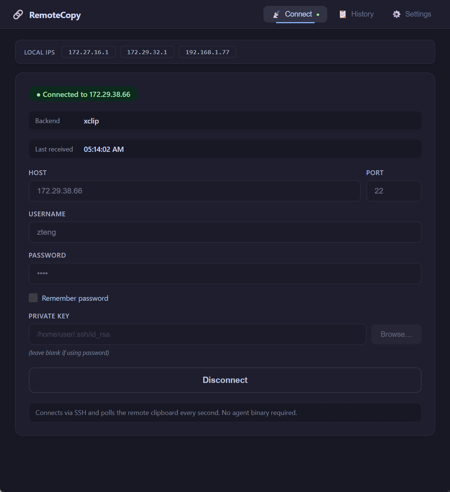
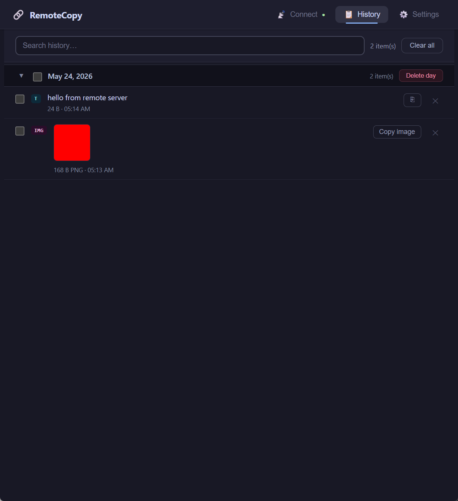
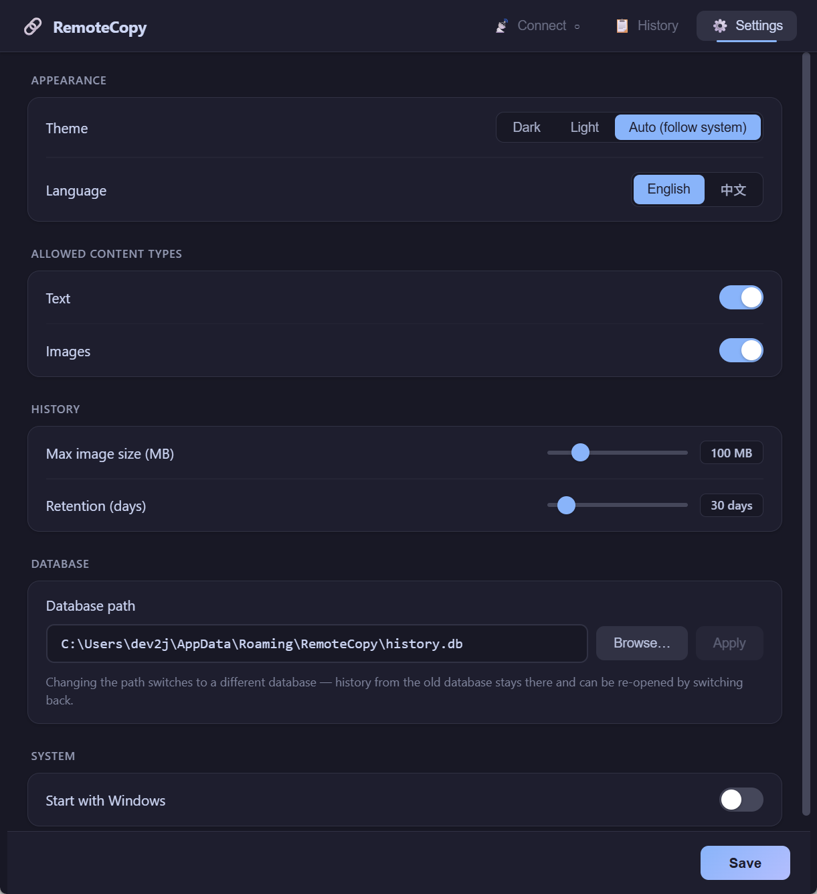
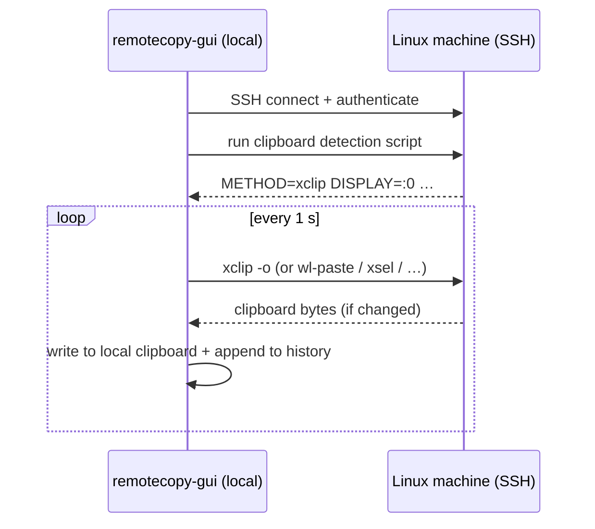

# RemoteCopy

[](https://rustup.rs)
[](https://tauri.app)
[](LICENSE)
[]()

**[简体中文](README.zh-CN.md)**

Sync your Linux clipboard to your local machine over SSH — no agent binary, no cloud, no middleman.

---

## Why This Exists

If you work across machines — Windows host running WSL, SSH into a remote Linux server, Mosh + Tmux + Neovim — you've hit this wall:

```
Windows Terminal → Linux → Mosh → Tmux → Neovim
       │              │       │       │       │
    OSC 52         X11/   blocks   own     own
    protocol      Wayland  OSC 52  buffer  register
```

Every layer has its own clipboard mechanism and none of them talk to each other:

- **Mosh** strips all OSC sequences by default, so OSC 52 copy signals from Neovim or Tmux never reach Windows Terminal
- **Tmux** intercepts mouse selections into its own buffer — `tmux-buffer` is separate from the system clipboard; you need `Shift`+select to bypass it
- **Neovim** `y` copies to the `"` register, not the system clipboard; `"+y` or `clipboard=unnamedplus` routes to the system clipboard, but on a remote server "system clipboard" means the remote X11/Wayland — not your local Windows
- **Headless Linux** has no X11 running at all, so `xclip`/`xsel` fail with `Can't open display`; X11 forwarding requires `ssh -X` which Mosh doesn't support

RemoteCopy cuts through all of this. The GUI on your local machine SSHs into Linux and polls the clipboard every second. No agent to install, no firewall rules, no TCP server — just outbound SSH.

---

## Features

- **Pure SSH polling** — the GUI SSHs into Linux and polls the clipboard every second; nothing to install on Linux beyond a clipboard tool
- **Auto-detect clipboard backend** — discovers `xclip`, `xsel`, `wl-paste`, `tmux`, or a file-based fallback automatically at connect time
- **Text and images** — plain text and PNG screenshots
- **History panel** — every captured item is logged, searchable, re-copyable, and grouped by date
- **SQLite storage** — history and image BLOBs are stored in a single local `.db` file; no loose files scattered around
- **System tray** — runs quietly in the background; left-click to restore
- **Light / Dark / Auto theme** — follows the OS theme or set it manually
- **Localization** — English and Simplified Chinese UI
- **Start with Windows** — optionally launch at login

---

## Screenshots

<table>
  <tr>
    <td align="center"><b>Connect</b></td>
    <td align="center"><b>History</b></td>
    <td align="center"><b>Settings</b></td>
  </tr>
  <tr>
    <td></td>
    <td></td>
    <td></td>
  </tr>
</table>

---

## How It Works

The GUI is the only binary. It opens an SSH connection to the remote Linux machine and runs a small shell detection script to find the best available clipboard tool. It then polls that tool every second, hashing the output to detect changes and emitting an event to the frontend only when something new arrives.



### Clipboard backend detection

At connect time the GUI runs a single detection script on the remote machine that:

1. Scans `/proc/*/environ` to find a running graphical session's `DISPLAY`, `WAYLAND_DISPLAY`, `XDG_RUNTIME_DIR`, and `XAUTHORITY`
2. Tests each tool (`xclip`, `xsel`, `wl-paste`) in order
3. Falls back to a tmux buffer read or a well-known temp file

The detected backend and its environment are reused for every subsequent poll — no repeated discovery overhead.

| Backend | Needs | Supports |
|---------|-------|----------|
| xclip | `apt install xclip` + X11 display | Text + Image (PNG) |
| xsel | `apt install xsel` + X11 display | Text only |
| wl-paste | `apt install wl-clipboard` + Wayland | Text + Image (PNG) |
| tmux | tmux running | Text only |
| file | writable `/tmp` | Text only |
| none | — | _(not connected)_ |

---

## Installation

### Windows GUI

Download from the [Releases](../../releases) page:

| File | Description |
|------|-------------|
| `RemoteCopy-Setup-x.y.z-win64.exe` | NSIS installer (recommended) |
| `RemoteCopy-Portable-x.y.z-win64.exe` | Single exe, no install needed |

Run the installer (or the portable exe), then launch **RemoteCopy** from the Start menu or system tray.

### macOS GUI

Download `RemoteCopy-x.y.z-mac-arm64.dmg` (Apple Silicon) or `RemoteCopy-x.y.z-mac-x64.dmg` (Intel) from the [Releases](../../releases) page.

Open the `.dmg`, drag **RemoteCopy** to Applications, and launch it.

> On first launch macOS may show "unidentified developer" — right-click the app → Open to bypass.

### Linux GUI

Download `remotecopy-gui_x.y.z_amd64.deb` from [Releases](../../releases):

```bash
sudo dpkg -i remotecopy-gui_x.y.z_amd64.deb
```

---

## Quick Start

### 1. Connect to Linux

Open RemoteCopy, go to the **Connect** tab, and fill in your SSH details:

| Field | Example |
|-------|---------|
| Host | `192.168.1.50` or WSL hostname |
| Port | `22` |
| Username | `alice` |
| Password | your SSH password |
| Private key | browse to `~/.ssh/id_ed25519` (takes precedence over password) |

Click **Connect**. The GUI detects the available clipboard backend automatically and starts polling.

### 2. Copy something on Linux

```bash
# In any terminal on the remote machine:
echo "hello from Linux" | xclip -selection clipboard

# Or yank from Neovim:
# "+y   (copies to system clipboard → RemoteCopy picks it up within 1 second)
```

The text (or image) appears in your local clipboard and in the **History** panel within one second.

---

## Usage

### History panel

- **Search** — type in the search box to filter items by text content
- **Copy** — click the copy button on any row to re-copy it to your clipboard
- **Image preview** — click a thumbnail to open a full-size modal; press Escape or click outside to close
- **Delete** — delete individual items, all items for a day, or a selection
- **Clear all** — removes all history (a confirmation dialog appears first)

### Disconnect

Click **Disconnect** in the Connect tab. The SSH session is closed and polling stops.

---

## Settings Reference

| Setting | Default | Description |
|---------|---------|-------------|
| Theme | `auto` | `auto` follows the OS; or choose `light` / `dark` |
| Language | `en` | `en` (English) or `zh-CN` (Simplified Chinese) |
| Allow text | ✅ | Capture text clipboard changes |
| Allow images | ✅ | Capture image (PNG) clipboard changes |
| Max payload | `10 MB` | Skip items larger than this |
| History retention | `30 days` | Items older than this are pruned on startup |
| Database path | see below | Path to the SQLite `.db` file |
| Start with Windows | ❌ | Auto-launch at login |

**Config file:** `%APPDATA%\RemoteCopy\config.json`  
**Database:** `%APPDATA%\RemoteCopy\history.db` (default; changeable in Settings)

Both text content and image BLOBs are stored in the SQLite database — no separate image files.

---

## Linux prerequisites

The remote machine needs at least one clipboard tool installed and accessible to your SSH user:

```bash
# For X11 sessions (most common — includes WSL with WSLg)
sudo apt install xclip        # recommended: text + images
sudo apt install xsel         # text only

# For Wayland sessions
sudo apt install wl-clipboard # text + images

# Verify (from a terminal that has DISPLAY or WAYLAND_DISPLAY set)
echo test | xclip -selection clipboard && xclip -selection clipboard -o
```

No firewall rules, no TCP ports, no agent binary needed. Only outbound SSH port 22 (or whatever port your sshd listens on).

---

## Building from Source

### Prerequisites

| Tool | Install |
|------|---------|
| [Rust 1.75+](https://rustup.rs) | `curl --proto '=https' --tlsv1.2 -sSf https://sh.rustup.rs \| sh` |
| [Bun](https://bun.sh) | `curl -fsSL https://bun.sh/install \| bash` |

> First build downloads ~150 crates and takes 5–10 minutes. Subsequent builds are fast.

### Windows — GUI

**Extra prerequisite:** WebView2 (bundled in Windows 11 / Edge; [download](https://developer.microsoft.com/microsoft-edge/webview2/) for Windows 10).

```powershell
cd remotecopy-gui
bun install
bun run tauri build -- --bundles nsis
```

| Artifact | Path |
|----------|------|
| NSIS installer | `src-tauri\target\release\bundle\nsis\RemoteCopy_x.y.z_x64-setup.exe` |
| Portable exe | `src-tauri\target\release\remotecopy-gui.exe` |

### macOS — GUI

**Extra prerequisite:** Xcode Command Line Tools.

```bash
xcode-select --install   # one-time setup
cd remotecopy-gui
bun install
bun run tauri build -- --bundles dmg,app
```

**Universal binary** (Intel + Apple Silicon):

```bash
rustup target add x86_64-apple-darwin aarch64-apple-darwin
bun run tauri build -- --bundles dmg --target universal-apple-darwin
```

### Linux — GUI (Ubuntu 22.04+)

```bash
sudo apt install -y libwebkit2gtk-4.1-dev libgtk-3-dev \
  libayatana-appindicator3-dev librsvg2-dev patchelf

cd remotecopy-gui
bun install
bun run tauri build
```

---

## Development

```powershell
# GUI with hot-reload (Windows)
cd remotecopy-gui
bun run tauri dev
```

**Extending the project:**

- **New Tauri command** → `#[tauri::command]` in `src-tauri/src/lib.rs`, register in `invoke_handler!`, call with `invoke()` from the frontend
- **New clipboard backend** → add detection output in `DETECT_SCRIPT` and a new `ClipboardMethod` variant in `src-tauri/src/ssh.rs`
- **New UI translation key** → add to `src/i18n/translations.ts` for both `en` and `zh-CN`

---

## Repository Layout

```
remotecopy/
└── remotecopy-gui/              # Desktop app (Tauri v2)
    ├── src/                     # Frontend (React + TypeScript)
    │   ├── App.tsx
    │   ├── types.ts
    │   ├── i18n/
    │   │   ├── LanguageContext.tsx
    │   │   └── translations.ts
    │   └── components/
    │       ├── ConnectForm.tsx   # SSH connection UI
    │       ├── HistoryList.tsx   # History panel + image preview
    │       └── Settings.tsx      # App settings
    └── src-tauri/               # Tauri backend (Rust)
        └── src/
            ├── lib.rs           # Tauri commands + app setup
            ├── ssh.rs           # SSH polling loop (russh)
            ├── clipboard.rs     # Write to local clipboard (arboard)
            ├── db.rs            # SQLite history + BLOB storage
            ├── storage.rs       # Config load/save
            └── tray.rs          # System tray
```

---

## License

[MIT](LICENSE)
