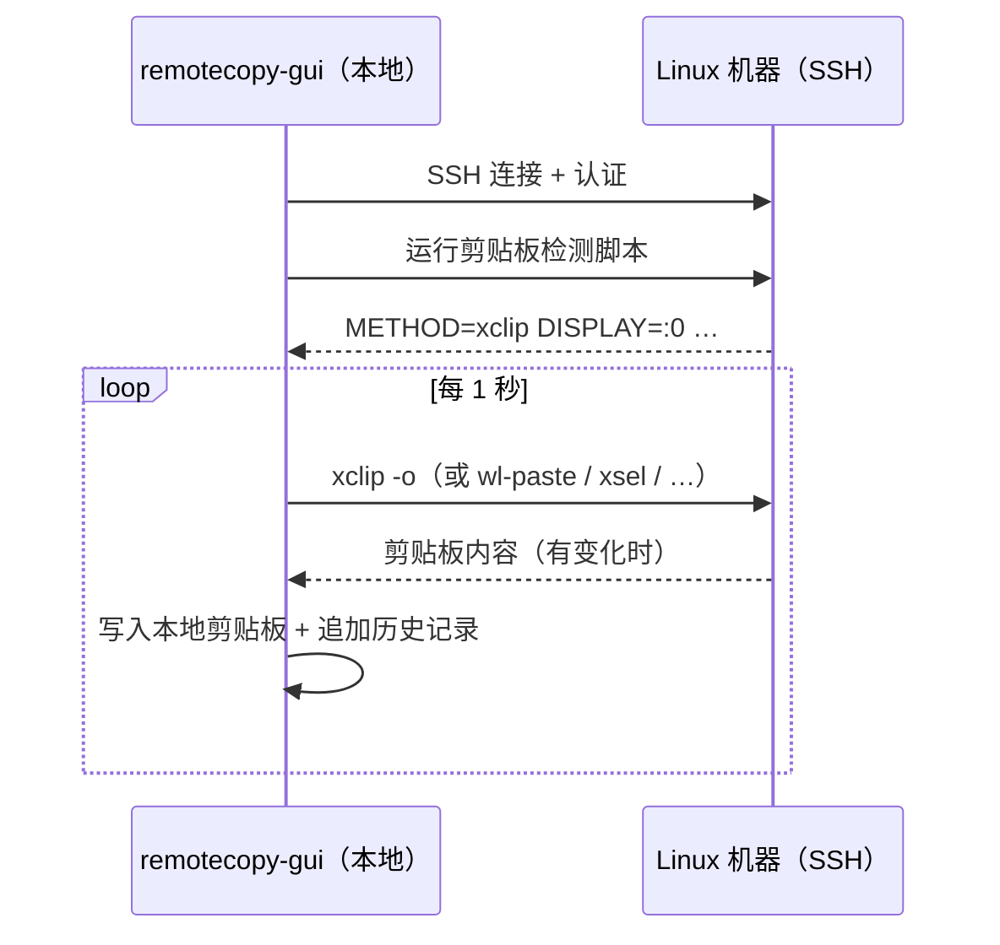

# RemoteCopy

[](https://rustup.rs)
[](https://tauri.app)
[](LICENSE)
[]()

**[English](README.md)**

通过 SSH 将 Linux 剪贴板同步到本地——无需在 Linux 上安装 Agent，无需云服务，无需中间商。

---

## 为什么需要这个工具

如果你的工作环境是 Windows 主机 + WSL，或者 SSH 连接远程 Linux 服务器，再套上 Mosh + Tmux + Neovim，你一定遇到过这个问题：

```
Windows Terminal → Linux → Mosh → Tmux → Neovim
       │              │       │       │       │
    OSC 52         X11/   阻断    自己的   自己的
    协议          Wayland OSC 52  缓冲区   寄存器
```

每一层都有自己的剪贴板机制，互不兼容——这就是经典的**剪贴板链断裂**问题：

- **Mosh** 默认过滤所有 OSC 序列，Neovim 或 Tmux 发出的 OSC 52 复制信号根本到不了 Windows Terminal
- **Tmux** 会把鼠标选区截获到自己的 `tmux-buffer`，与系统剪贴板是两套体系；需要按住 `Shift` 才能绕过
- **Neovim** 的 `y` 只复制到 `"` 寄存器；`"+y` 或 `clipboard=unnamedplus` 虽然能走系统剪贴板，但在远程 Linux 上"系统剪贴板"指的是远端的 X11/Wayland，而不是你本地的 Windows
- **无图形环境的 Linux 服务器** 根本没有运行 X11，`xclip`/`xsel` 会报错 `Can't open display`；X11 转发需要 `ssh -X`，而 Mosh 不支持

RemoteCopy 绕开了所有这些障碍。本地 GUI 通过 SSH 连入 Linux，每秒轮询一次剪贴板。无需在 Linux 上安装任何 Agent，无需防火墙规则，无需 TCP 服务器——只需一条出站 SSH 连接。

---

## 功能特性

- **纯 SSH 轮询** — GUI 主动 SSH 连入 Linux，每秒轮询剪贴板；Linux 侧除剪贴板工具外无需任何额外安装
- **自动检测剪贴板后端** — 连接时自动发现 `xclip`、`xsel`、`wl-paste`、`tmux` 或基于文件的回退方式
- **支持文本和图片** — 纯文本及 PNG 截图
- **历史记录面板** — 所有捕获内容均可查看、搜索、重新复制，并按日期分组
- **SQLite 存储** — 历史记录和图片 BLOB 均存储在单个本地 `.db` 文件中，无散落文件
- **系统托盘** — 静默后台运行，左键单击还原窗口
- **亮色 / 暗色 / 自动主题** — 跟随系统主题或手动指定
- **多语言** — 支持英文和简体中文界面
- **开机自启** — 可选登录时自动启动

---

## 截图

<table>
  <tr>
    <td align="center"><b>连接</b></td>
    <td align="center"><b>历史记录</b></td>
    <td align="center"><b>设置</b></td>
  </tr>
  <tr>
    <td></td>
    <td></td>
    <td></td>
  </tr>
</table>

---

## 工作原理

GUI 是唯一的二进制文件。它向远程 Linux 机器建立 SSH 连接，运行一个小型 Shell 检测脚本来找到最合适的剪贴板工具，然后每秒轮询该工具，通过哈希比对检测变化，只在有新内容时才向前端发送事件。



### 剪贴板后端自动检测

连接时 GUI 在远程机器上运行一次检测脚本，流程如下：

1. 扫描 `/proc/*/environ`，找到正在运行的图形会话的 `DISPLAY`、`WAYLAND_DISPLAY`、`XDG_RUNTIME_DIR` 和 `XAUTHORITY`
2. 依次测试各工具（`xclip`、`xsel`、`wl-paste`）
3. 回退到 tmux 缓冲区读取或已知临时文件路径

检测到的后端及其环境变量会被复用于后续所有轮询，无重复检测开销。

| 后端 | 依赖 | 支持类型 |
|------|------|----------|
| xclip | `apt install xclip` + X11 显示 | 文本 + 图片（PNG） |
| xsel | `apt install xsel` + X11 显示 | 仅文本 |
| wl-paste | `apt install wl-clipboard` + Wayland | 文本 + 图片（PNG） |
| tmux | 运行中的 tmux | 仅文本 |
| file | 可写的 `/tmp` | 仅文本 |
| none | — | _（未连接）_ |

---

## 安装

### Windows GUI

从 [Releases](../../releases) 页面下载：

| 文件 | 说明 |
|------|------|
| `RemoteCopy-Setup-x.y.z-win64.exe` | NSIS 安装包（推荐） |
| `RemoteCopy-Portable-x.y.z-win64.exe` | 单文件便携版，无需安装 |

运行安装包（或便携版），从开始菜单或系统托盘启动 **RemoteCopy**。

### macOS GUI

从 [Releases](../../releases) 下载 `RemoteCopy-x.y.z-mac-arm64.dmg`（Apple Silicon）或 `RemoteCopy-x.y.z-mac-x64.dmg`（Intel）。

打开 `.dmg`，将 **RemoteCopy** 拖入应用程序文件夹，然后启动。

> 首次启动 macOS 可能提示"未知开发者"——右键单击应用 → 打开 即可绕过。

### Linux GUI

从 [Releases](../../releases) 下载 `remotecopy-gui_x.y.z_amd64.deb`：

```bash
sudo dpkg -i remotecopy-gui_x.y.z_amd64.deb
```

---

## 快速上手

### 第一步 — 连接到 Linux

打开 RemoteCopy，进入 **Connect** 标签页，填写 SSH 信息：

| 字段 | 示例 |
|------|------|
| Host | `192.168.1.50` 或 WSL 主机名 |
| Port | `22` |
| Username | `alice` |
| Password | SSH 密码 |
| Private key | 选择 `~/.ssh/id_ed25519`（优先于密码） |

点击 **Connect**。GUI 会自动检测可用的剪贴板后端并开始轮询。

### 第二步 — 在 Linux 上复制内容

```bash
# 在远程机器的任意终端中：
echo "hello from Linux" | xclip -selection clipboard

# 或在 Neovim 中 yank：
# "+y   （复制到系统剪贴板 → RemoteCopy 在 1 秒内捕获）
```

文本（或图片）会在一秒内出现在你的本地剪贴板和 **History** 面板中。

---

## 使用说明

### 历史记录面板

- **搜索** — 在搜索框中输入内容，按文本筛选条目
- **复制** — 点击任意行的复制按钮，将其重新复制到剪贴板
- **图片预览** — 点击缩略图可打开全尺寸模态框；按 Escape 或点击外部关闭
- **删除** — 可删除单条、某天全部，或选中的多条记录
- **清空全部** — 删除所有历史记录（会弹出确认对话框）

### 断开连接

在 Connect 标签页点击 **Disconnect**，SSH 会话关闭，轮询停止。

---

## 设置说明

| 设置项 | 默认值 | 说明 |
|--------|--------|------|
| 主题 | `auto` | `auto` 跟随系统，可手动选择 `light` / `dark` |
| 语言 | `en` | `en`（英文）或 `zh-CN`（简体中文） |
| 允许文本 | ✅ | 捕获文本剪贴板变化 |
| 允许图片 | ✅ | 捕获图片（PNG）剪贴板变化 |
| 最大载荷 | `10 MB` | 超过此大小的内容将被跳过 |
| 历史保留天数 | `30 天` | 启动时自动删除超过此天数的记录 |
| 数据库路径 | 见下方 | SQLite `.db` 文件的路径 |
| 开机自启 | ❌ | 登录时自动启动 |

**配置文件：** `%APPDATA%\RemoteCopy\config.json`  
**数据库：** `%APPDATA%\RemoteCopy\history.db`（默认；可在设置中更改）

文本内容和图片 BLOB 均存储在 SQLite 数据库中，不产生额外的独立文件。

---

## Linux 环境准备

远程机器上需要安装至少一种剪贴板工具，且你的 SSH 用户可以访问：

```bash
# X11 会话（最常见，包括带 WSLg 的 WSL）
sudo apt install xclip        # 推荐：支持文本 + 图片
sudo apt install xsel         # 仅文本

# Wayland 会话
sudo apt install wl-clipboard # 支持文本 + 图片

# 验证（在设置了 DISPLAY 或 WAYLAND_DISPLAY 的终端中）
echo test | xclip -selection clipboard && xclip -selection clipboard -o
```

无需防火墙规则、无需开放 TCP 端口、无需在 Linux 上安装 Agent 二进制文件。只需出站 SSH 端口 22（或你的 sshd 监听的端口）。

---

## 从源码编译

### 环境依赖

| 工具 | 安装方式 |
|------|----------|
| [Rust 1.75+](https://rustup.rs) | `curl --proto '=https' --tlsv1.2 -sSf https://sh.rustup.rs \| sh` |
| [Bun](https://bun.sh) | `curl -fsSL https://bun.sh/install \| bash` |

> 首次编译需下载约 150 个 crate，耗时 5~10 分钟，后续编译很快。

### Windows — GUI

**额外依赖：** WebView2（Windows 11 / Edge 已内置；Windows 10 需[单独下载](https://developer.microsoft.com/microsoft-edge/webview2/)）。

```powershell
cd remotecopy-gui
bun install
bun run tauri build -- --bundles nsis
```

| 产物 | 路径 |
|------|------|
| NSIS 安装包 | `src-tauri\target\release\bundle\nsis\RemoteCopy_x.y.z_x64-setup.exe` |
| 便携版 | `src-tauri\target\release\remotecopy-gui.exe` |

### macOS — GUI

**额外依赖：** Xcode 命令行工具。

```bash
xcode-select --install   # 一次性配置
cd remotecopy-gui
bun install
bun run tauri build -- --bundles dmg,app
```

**通用二进制**（同时支持 Intel 和 Apple Silicon，编译时间约为 2 倍）：

```bash
rustup target add x86_64-apple-darwin aarch64-apple-darwin
bun run tauri build -- --bundles dmg --target universal-apple-darwin
```

### Linux — GUI（Ubuntu 22.04+）

```bash
sudo apt install -y libwebkit2gtk-4.1-dev libgtk-3-dev \
  libayatana-appindicator3-dev librsvg2-dev patchelf

cd remotecopy-gui
bun install
bun run tauri build
```

---

## 开发调试

```powershell
# GUI 热重载（Windows）
cd remotecopy-gui
bun run tauri dev
```

**扩展项目：**

- **新增 Tauri 命令** → 在 `src-tauri/src/lib.rs` 中添加 `#[tauri::command]`，注册到 `invoke_handler!`，前端用 `invoke()` 调用
- **新增剪贴板后端** → 在 `src-tauri/src/ssh.rs` 的 `DETECT_SCRIPT` 中添加检测输出，并新增对应的 `ClipboardMethod` 变体
- **新增 UI 翻译** → 在 `src/i18n/translations.ts` 中同时添加 `en` 和 `zh-CN` 的 key

---

## 项目结构

```
remotecopy/
└── remotecopy-gui/              # 桌面应用（Tauri v2）
    ├── src/                     # 前端（React + TypeScript）
    │   ├── App.tsx
    │   ├── types.ts
    │   ├── i18n/
    │   │   ├── LanguageContext.tsx
    │   │   └── translations.ts
    │   └── components/
    │       ├── ConnectForm.tsx   # SSH 连接界面
    │       ├── HistoryList.tsx   # 历史记录面板 + 图片预览
    │       └── Settings.tsx      # 应用设置
    └── src-tauri/               # Tauri 后端（Rust）
        └── src/
            ├── lib.rs           # Tauri 命令 + 应用初始化
            ├── ssh.rs           # SSH 轮询循环（russh）
            ├── clipboard.rs     # 写入本地剪贴板（arboard）
            ├── db.rs            # SQLite 历史记录 + BLOB 存储
            ├── storage.rs       # 配置读写
            └── tray.rs          # 系统托盘
```

---

## 许可证

[MIT](LICENSE)
